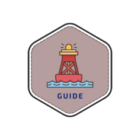

# guide 

<!-- badges: start -->

<!-- badges: end -->

The goal of guide is to ...

## Installation

You can install the development version of guide from [GitHub](https://github.com/) with:

``` r
# install.packages("pak")
#pak::pak("jpmonteagudo28/guide")
```

## Example

This is a basic example which shows you how to solve a common problem:

``` r
library(guide)
## basic example code
```
